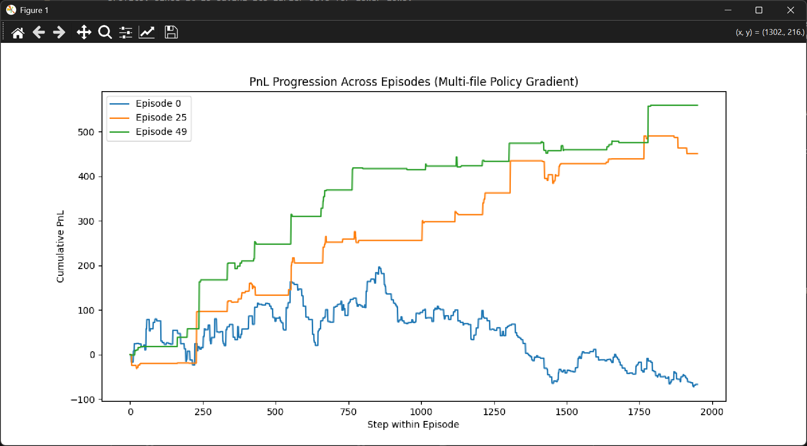
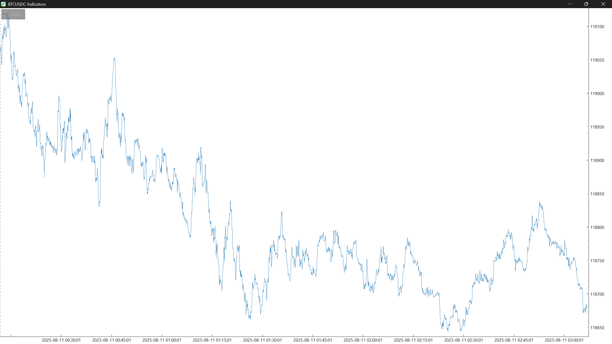

# RL-Augmented-Trader

**A real-time, deep reinforcement learning trading bot using live Binance 5-second tick data, technical indicators, and a custom PyTorch policy gradient agent to make buy/hold/sell decisions.**

This project is a hands-on experiment in building an RL-powered trading system from scratch — no high-level frameworks like Stable-Baselines or FreqTrade. Just raw PyTorch, real-time data, and a simple, focused environment to simulate market PnL.

---

## Why This Project?

This experiment is meant to enhance an existing, successful, rules-based trading bot of mine with RL and NN features. It is also part of my portfolio to demonstrate **end-to-end applied machine learning** in a real financial setting. It combines:

- Low-latency live data ingestion  
- Feature engineering using technical indicators  
- A from-scratch trading environment  
- A custom RL agent (initially a policy gradient model)

The goal is to **maximize real trading performance** and push this agent to a level that would be compelling to hedge fund researchers and quant teams.

---

Contact: nicolasroy11@gmail.com


## Features

✅ Real-time 5s data ingestion from Binance  
✅ Postgres and DuckDB-based tick storage for fast analytics  
✅ Custom PyTorch RL agents (Policy Gradient, PPO with TCN for temporal perception and XGBoost)  
✅ Live environment with simulated trading logic  
✅ Normalized technical indicators: RSI, EMA, MACD, Bollinger bands  
✅ Finplot-based data visualization  
✅ Training insights: logits, action probabilities, PnL tracking    
✅ Django apps for visualization and eventually meaningful interaction  


## Background: The Lowrider

In my years of creating rules-based trading automations from absolute scratch, one agent has been consistently successful: the Lowrider. This agent's basic set of principles read like the age old adage of buy low, sell high. Here, the distinction happens in the methodology. The agent enters a trade cycle by buying a small amount without regards to market conditions and only sells when a profit is reached. But what happens if the market moves against its position? It buys again at the new, lower price, in what is commonly referred to as a DCA (dollar-cost averaging) maneuver. The lower the price goes, the higher the lot size being bought, and thus the faster the averaging catches up to the break-even point in such a way that your average upward market correction in a downward trend is enough to drive the average position price above break even. At this point, the agent sells. Selling a trade cycle at a loss is not an option - you either buy more or sell at a profit. In this way, the negative trade cycle outcome is mechanically impossible.

I have been running this agent on a cloud instance with roughly this logic for just over a year and a half with fairly consistent returns annualizing at ~20-30% of initial wallet size, barring any hiccups and interruptions.

The problem, as some may have guessed, is that in a steep downtrend, the occasional upward correction may not be enough to salvage a failing trade cycle, and the agent may continue to buy and buy and eventually run out of funds. I have seen it happen, and although it always recoverd naturally, it is unwise to rely on the recovery of the market alone.

One solution was to increase what I call the reluctance factor, which is a very primitive coefficient used to determine the maximum amount that can be spent on a single trade at any point in a trade cycle. Simply put, that amount will be 

    highest single buy size = wallet size/reluctance factor.

This crude method at least puts a clamp on runaway buying, the tradeoff being that in an upward trending market, the agent will only be making tiny profits, since it is saving its larger buys for lower lows.

There are many details involved in the sizing of lots, some of which actually involved using an integral to figure out, but that is outside the scope of this description, and a patent may be pending in the near future. For this reason, the Lowrider repo has to be kept private until this experiment concludes.


## The RL Angle: Adaptive Lot Sizing

The contents of this repository will be an exploration of ways to better size lots given the current market conditions and adapt the Lowrider to use this to profit maximally in both upward and downward trending markets.

The concept is rather simple: take in a time window of recent market observations, feed them to a neural network and output the probablities for three states: buy, sell, or hold. The buy probability can then be used directly on the lot calculation, leading to larger long-term gains.

So far, the preliminary tests appear promising on a down trend over 50 episodes of single blocking buy/sell cycles:

<!-- <div style="display: inline"> -->

</br>
trained over the following price action:
</br>

<!-- </div> -->

## Installation

```bash
git clone https://github.com/yourusername/rl-augmented-trader.git
cd rl-augmented-trader
pip install -r requirements.txt
python manage.py migrate
python manage.py runserver
```

### Example API calls:

Train model:
- POST /api/training/run_ppo_tcn_futures

Run trading:
- POST /api/trading/run_single_buy_ppo_trader?feature_set=default

Simple 5-second data collection:
- POST /api/data/start_data_collection

Configuration: adjust settings in runtime_settings.py based on runtime_settings_template.py

# Licenses and builds

[](https://www.python.org/)  
[](LICENSE)  
[](#)  

---

## Features

- 📈 Train reinforcement learning models for algorithmic trading  
- ⚡ Real-time trading execution via API  
- 🔧 Configurable runtime settings (`runtime_settings.py`)  
- 🛠️ Modular code structure (`classes.py`, `helpers.py`)  
- 🌐 REST endpoints for training & trading  


### Configuration
Modify runtime_settings.py to adjust:

- Model parameters

- Data sources

- Trading strategy settings

### Tech Stack
- Python 3.9+

- Django / Django REST Framework

- Reinforcement Learning Libraries (PyTorch, XGBoost)

### Contributing
- Fork this repo

- Create your feature branch (git checkout -b feature/awesome-thing)

- Commit your changes (git commit -m 'Add awesome thing')

- Push to the branch (git push origin feature/awesome-thing)

- Open a Pull Request and set me as the reviewer (nicolasroy11)

